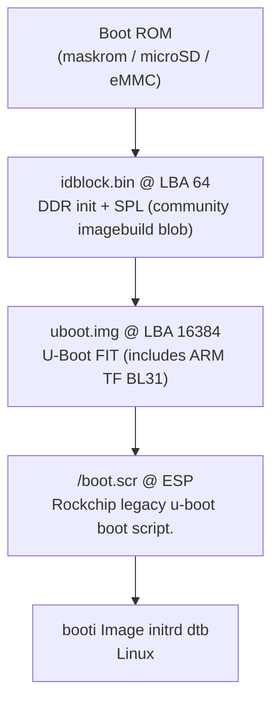

# Boot chain, partition layout, and U-Boot

<!-- toc -->

- [Boot chain, partition layout, and U-Boot](#boot-chain-partition-layout-and-u-boot)
  - [Boot chain](#boot-chain)
  - [Vendor U-Boot quirks + requirements](#vendor-u-boot-quirks--requirements)
  - [Partition layout](#partition-layout)
  - [NixOS `boot.scr` generation](#nixos-bootscr-generation)
    - [Serial & display console notes](#serial--display-console-notes)
  - [Updates & maintenance](#updates--maintenance)

<!-- /toc -->

## Boot chain



> [!NOTE]
> `resource.img` @ LBA 24580 is optional and only holds bootsplash logos.

## Vendor U-Boot quirks + requirements

The vendor U-Boot build (rockchip-linux 2017.09) has some strict requirements:

1. **Partition scanning:** It runs `part list -bootable` to find GPT partitions
   marked with the `legacy_boot` flag (GPT attribute bit 2).
2. **Filesystem support:** The built-in driver only supports FAT32. Ext4, btrfs,
   and normal EFI boot will not work. It looks specifically for `/boot.scr` at
   the root of the FAT filesystem.
3. **Silent fallback:** If the target medium lacks the `legacy_boot` attribute or
   fails to load, U-Boot will move to the next bootable medium (usually internal
   eMMC). So, if micro SD card boot fails with no output, check the partition
   attributes first.
4. **Modified `boot.scr` header:** Rockchip patched the payload parser to check
   for a non-standard terminator: `while (*data++ != IMAGE_PARAM_INVAL)`
   (`0xffffffff`). Usually `mkimage` writes `0x00000000`, which causes U-Boot to
   throw `SCRIPT FAILED` and fall back. So, we generate the script using
   [`../pkgs/rk-boot-script`](../pkgs/rk-boot-script) to match Rockchip's format.
5. **Runtime environment:** At boot time, U-Boot populates `${devtype}`,
   `${devnum}`, `${kernel_addr_c}`, `${fdt_addr_r}`, and `${ramdisk_addr_r}`.

## Partition layout

| #   | Label           | Type GUID / Code | Sector Range        | Size    | Description                                                                                             |
| --- | --------------- | ---------------- | ------------------- | ------- | ------------------------------------------------------------------------------------------------------- |
| 1   | `FW`            | `8300`           | `64` – `65535`      | 32 MiB  | Raw firmware blobs (flashed at raw offsets listed above)                                                |
| 2   | `ESP`           | `ef00`           | `65536` – `1114111` | 512 MiB | FAT32 (**must have GPT attr bit 2 set**). Contains `/boot.scr`, `/boot.cmd`, kernel, initramfs, and DTB |
| 3   | `NIXOS-FYDETAB` | `8300`           | `1114112` – end     | Rest    | Root filesystem (btrfs)                                                                                 |

> [!WARNING]
> Keep the filename exactly as `rk3588s-fydetab_duo.dtb` (hyphen before `fydetab`, underscore after), as this matches conventions of the vendor's DTS. Renaming it to all-hyphens or all-underscores will break boot and leave the display black - and give you a lot of headaches!

## NixOS `boot.scr` generation

```uboot
setenv bootpart 2
setenv rootpart 3
setenv fdtfile /dtbs/rockchip/rk3588s-fydetab_duo.dtb
setenv linux_image /vmlinuz-fydetab
setenv initrd /initramfs-fydetab.img
part uuid ${devtype} ${devnum}:3 root_uuid
setenv bootargs rootfstype=btrfs rootwait rw root=PARTUUID=${root_uuid} <config.boot.kernelParams>
load ${devtype} ${devnum}:${bootpart} ${kernel_addr_c} ${linux_image}
load ${devtype} ${devnum}:${bootpart} ${ramdisk_addr_r} ${initrd}
load ${devtype} ${devnum}:${bootpart} ${fdt_addr_r} ${fdtfile}
booti ${kernel_addr_c} ${ramdisk_addr_r}:${filesize} ${fdt_addr_r}
```

If root is on a btrfs subvolume, `rootflags=subvol=<name>` is appended
automatically by
[`modules/fydetab-duo/boot-loader.nix`](../modules/fydetab-duo/boot-loader.nix).

### Serial & display console notes

- The kernel will route `/dev/console` to whichever `console=` parameter comes
  **last**. So, make sure `console=tty1` is at the end of the argument list so
  logs actually display on the panel. I wonder how this was discovered...
- `ttyFIQ0` is the hardware FIQ debugger on UART2 (1.5 MBaud).
- Arguments inside the device tree's `/chosen` node take precedence over
  U-Boot's `bootargs` in the case of duplicate keys.
